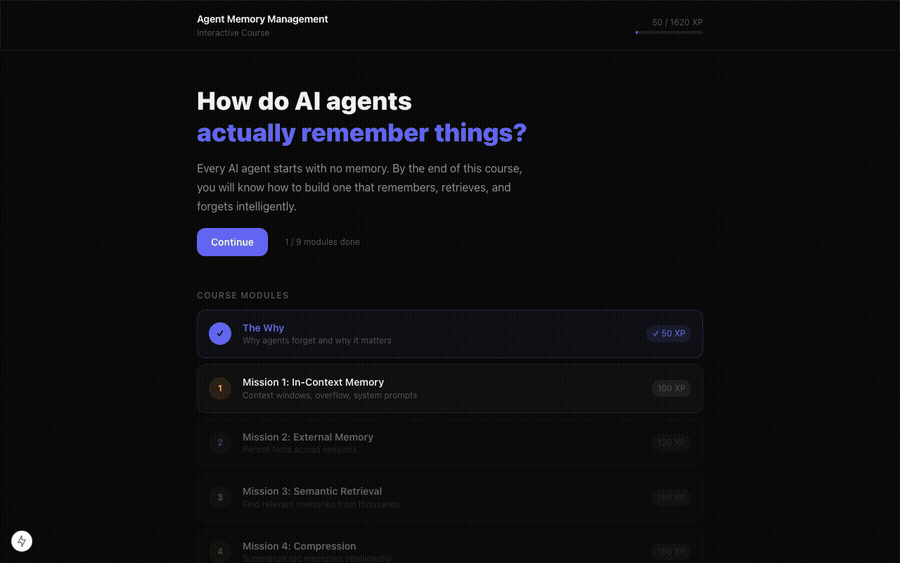

# Agent Memory Management

**An interactive course on how AI agents remember, retrieve, and forget.**



---

## What you will learn

Every AI agent starts with no memory. This course teaches you how to fix that — one mission at a time.

| Module | Topic | XP |
|---|---|---|
| Lesson 0 | The Why — why agents forget and why it matters | 50 |
| Mission 1 | In-Context Memory — context windows, overflow, system prompts | 100 |
| Mission 2 | External Memory — persist facts across sessions | 120 |
| Mission 3 | Semantic Retrieval — find relevant memories from thousands | 150 |
| Mission 4 | Compression — summarize old memories intelligently | 150 |
| Mission 5 | Tiered Memory — 4-layer memory architecture | 175 |
| Mission 6 | Multi-Agent Memory — share memory across agent teams | 200 |
| Mission 7 | Eviction Policies — decide what to keep and what to forget | 175 |
| Mission 8 | Complete System — build a production-ready memory system | 500 |

## Features

- Interactive visualizations (context window overflow, working memory, hallucination)
- Quizzes with instant feedback
- XP progress tracked in your browser
- Live AI exercise in Mission 1 (bring your own Anthropic API key)
- Zero dependencies — pure HTML, CSS, and JavaScript
- Works offline after first load

## Run locally

Just open `index.html` in a browser. No build step, no server needed.

```bash
open index.html
```

## Live demo

Deployed on GitHub Pages: [sameer-goel.github.io/Agent-Memory-Management](https://sameer-goel.github.io/Agent-Memory-Management/)

## Built with

- Vanilla HTML / CSS / JavaScript
- Anthropic Claude API (Mission 1 live exercise)
- Progress stored in `localStorage`
